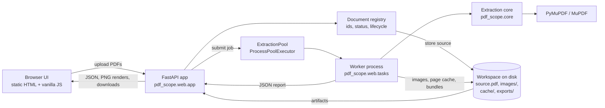

# PDF Scope

[](https://github.com/mborchuk/pdf-scope/actions/workflows/ci.yml)
[](LICENSE)
[](https://www.python.org/downloads/)
[](https://github.com/pymupdf/pymupdf)
[](docs/schema.md)

**Take a PDF apart and see everything inside it** — the object model, page
contents, text down to individual characters, images, vector paths,
coordinates, fonts, annotations, forms, attachments and metadata. Every
extracted element can be viewed, copied and downloaded. Several documents can
be open at once.

Runs entirely on your machine. No accounts, no database, no cloud, no network
calls.

## Table of contents

- [Why](#why)
- [What it shows](#what-it-shows)
- [Install and run](#install-and-run)
- [The interface](#the-interface)
- [Documentation](#documentation)
- [Architecture](#architecture)
- [Extraction output](#extraction-output)
- [What is exposed](#what-is-exposed)
- [What PyMuPDF cannot reach](#what-pymupdf-cannot-reach)
- [Multi-document behaviour](#multi-document-behaviour)
- [HTTP API](#http-api)
- [Use the core without the UI](#use-the-core-without-the-ui)
- [Configuration](#configuration)
- [Development](#development)
- [Known limitations](#known-limitations)
- [Licence](#licence)

## Why

PDF viewers show you the rendered result. Extraction libraries give you the
text. Neither answers *"what is actually in this file, and where?"*

This tool does: the catalog and page tree, every indirect object, the operators
that draw each page, every span of text with its font and colour and bounding
box, every image with its filters and placements, every path with its
coordinates — presented so each element can be inspected in place on the
rendered page and taken out of the app for use elsewhere.

## What it shows

- **Structure** — catalog, page tree, structure tree (tagging), name trees,
  named destinations, outline, object-type histogram, trailer and document
  `/ID`, object-stream and cross-reference-stream detection.
- **Objects** — load any object by xref number: dictionary entries, raw source,
  stream sizes, decoded stream, and every outgoing reference as a link.
- **Content streams** — the decompiled view: each operator with its operands,
  byte offset and meaning, including inline images.
- **Text** — page, block, line, span and character level, each with bounding
  box, font, size, colour and style flags; reading order preserved.
- **Images** — bytes in the original format, dimensions, DPI, colourspace, bit
  depth, filters, SMask; deduplicated per xref while every placement keeps its
  own bbox and matrix.
- **Vector graphics** — paths with full coordinates, stroke and fill colours,
  width, dashes, opacity, layer.
- **Everything else** — annotations, links, AcroForm fields and values,
  embedded files, optional content groups, document JavaScript, XMP and Info
  metadata, fonts with embedding and subset information, encryption method and
  decoded permissions.
- **The gaps** — a dedicated tab lists what exists in PDFs but cannot be
  reached through PyMuPDF, so nothing is silently missing.

## Install and run

Python 3.10 or newer. PyMuPDF ships wheels, so there is nothing to compile.

```bash
python3 -m venv .venv
```

```bash
.venv/bin/pip install -r requirements.txt
```

```bash
.venv/bin/python -m pdf_scope
```

Open <http://127.0.0.1:8000>. Options: `--host`, `--port`, `--reload`.
`make install` and `make run` do the same.

Or in Docker, with no Python on the host:

```bash
docker build --load -t pdf-scope .
docker run --rm -p 127.0.0.1:8000:8000 pdf-scope
```

`make docker-build` and `make docker-run` wrap those. **Keep the published port
on `127.0.0.1`**: the app has no authentication, so binding every interface with
`-p 8000:8000` would let anyone who can reach the machine upload files and read
every open document. Details, volumes and environment variables:
[docs/configuration.md](docs/configuration.md#running-with-docker).

Full walkthrough: [docs/getting-started.md](docs/getting-started.md).

## The interface

```
┌──────────────────────────────────────────────────────────────────────┐
│ PDF Scope        [Open PDFs] [Download everything] pool status   │
├───────────────┬──────────────────────────────────────────────────────┤
│ Documents     │ file.pdf · PDF 1.7 · 4 pages · 11 KB · sha256 … · id  │
│ ┌───────────┐ │            [Document JSON] [.txt] [.md] [Images] […]  │
│ │ a.pdf     │ ├──────────────────────────────────────────────────────┤
│ │ ready   4 │ │ Page │ Structure │ Objects │ Metadata │ Fonts │ …     │
│ ├───────────┤ ├──────────────────────────────────────────────────────┤
│ │ b.pdf     │ │  ‹ › page 2 of 4   zoom ▓▓▓  ☑blocks ☐lines ☑images  │
│ │ analyzing │ │ ┌───────────────────────────┐ ┌────────────────────┐ │
│ └───────────┘ │ │  rendered page + overlays │ │ element details    │ │
│               │ └───────────────────────────┘ └────────────────────┘ │
└───────────────┴──────────────────────────────────────────────────────┘
```

Bounding boxes for text blocks, lines, spans, characters, images, drawings,
annotations, links and form fields are drawn **on the rendered page**, each
type toggleable, aligned at any zoom and on rotated pages. Click one for its
details, the underlying object, and copy/download actions.

Every panel is documented in [docs/ui-guide.md](docs/ui-guide.md).

## Documentation

| Document | Contents |
| --- | --- |
| [Getting started](docs/getting-started.md) | Install, run, first document, tour |
| [How a PDF is built](docs/pdf-primer.md) | Objects, xrefs, page tree, resources, content streams, coordinate systems |
| [Architecture](docs/architecture.md) | Process model, module map, request flows, design decisions |
| [User interface guide](docs/ui-guide.md) | Every panel, overlay and action |
| [HTTP API reference](docs/api.md) | All endpoints, parameters, status codes, examples |
| [Extraction schema](docs/schema.md) | Every output field, field by field |
| [Core Python API](docs/core-api.md) | Scripting without the web layer |
| [Coverage](docs/coverage.md) | Feature-by-feature: exposed, partial, or unreachable |
| [Multi-document behaviour](docs/multi-document.md) | Identity, isolation, concurrency, lifecycle |
| [Configuration and operations](docs/configuration.md) | Variables, limits, performance, deployment |
| [Troubleshooting](docs/troubleshooting.md) | Symptoms, causes, fixes |
| [Development](docs/development.md) | Code map, tests, common tasks, releases |

Also: [CHANGELOG](CHANGELOG.md) · [CONTRIBUTING](CONTRIBUTING.md) ·
[SECURITY](SECURITY.md) · [NOTICE](NOTICE.md) ·
[CODE_OF_CONDUCT](CODE_OF_CONDUCT.md)

## Architecture



Three choices worth knowing up front:

- **The extraction core has no web dependency.** `pdf_scope.core` takes a
  file path and returns JSON-serialisable data; it is importable, testable and
  scriptable on its own.
- **All PDF work runs in worker processes.** PyMuPDF's documentation states it
  *"does not support running on multiple threads"* and recommends
  `multiprocessing`; extraction is CPU-bound anyway, so a
  `ProcessPoolExecutor` keeps the event loop free and caps concurrency.
- **No build step for the UI.** One HTML file, one CSS file, one JS file, no
  npm, no CDN, works offline.

Details and trade-offs: [docs/architecture.md](docs/architecture.md).

## Extraction output

Two JSON reports, both `schema_version: "1.0"`:

- the **document report** — identity, file structure, object-model profile,
  encryption, metadata, structure trees, fonts, attachments, forms, optional
  content, JavaScript, page summaries, known limitations;
- the **page report** — page dictionary and boxes, matrices, resources, content
  streams with the operator listing, text at every granularity, images,
  drawings, annotations, links, widgets, xobjects, fonts.

Everything is JSON-native; binary payloads are written to the artifact
directory and referenced by name. Field-by-field reference:
[docs/schema.md](docs/schema.md).

All coordinates are **PDF points in PyMuPDF space**: origin top-left of
`page.rect`, y growing downwards, page rotation already applied. Each page
report carries the matrices to convert to the PDF's own bottom-left space —
see [coordinate systems](docs/pdf-primer.md#coordinate-systems).

## What is exposed

| Area | Highlights |
| --- | --- |
| Document | PDF version, page/chapter/version counts, trailer, `/ID`, catalog xref, page mode and layout, `/MarkInfo`, language, page labels, repaired-on-open, fast web view |
| Object model | xref slots, per-`/Type` histogram, stream counts, object streams, cross-reference streams; any object by number with entries, source, stream sizes, decoded stream and references |
| Pages | All five boxes plus `page.rect`, `/Rotate`, four matrices, page dictionary, `/Resources` per category (direct and indirect) |
| Content streams | Per-stream xrefs, filters, raw/decoded sizes, decoded text, and an ordered operator listing with operands, offsets and descriptions |
| Tables | Detected from ruling lines and text alignment: bounding box, row and column counts, header names, cell rectangles, cell text and Markdown. Labelled as a detection, because PDF has no table object |
| Document overview | Producer, creator, dates, page sizes, and counts of text, images, vector paths, tables, annotations, links and form fields across the document |
| Text | Page, block, line, span, character; bbox, font, size, colour, alpha, ascender/descender, font and style flags, writing mode, direction |
| Fonts | Base name, subtype, embedded flag and extension, subset prefix, encoding, resource name, `/FontDescriptor` and `/ToUnicode` xrefs, usage per page |
| Images | Original bytes, pixel size, DPI, colourspace, bit depth, filters, SMask, per-placement bbox and matrix, inline images |
| Vector graphics | Full path items, stroke and fill, width, dashes, caps/joins, opacity, layer, clip rect |
| Tagging | `/StructTreeRoot` walk with tags, `/Alt`, `/ActualText`, language, page links |
| Navigation | Outline with destinations, named destinations, name trees |
| Other | Annotations of every type, links, AcroForm fields and values, embedded files, optional content, document JavaScript, XMP and Info metadata, encryption method and decoded permissions |

Complete matrix, including partial and unreachable features:
[docs/coverage.md](docs/coverage.md).

## What PyMuPDF cannot reach

Reported in every document report, in the UI's **Not extractable** tab, and in
[docs/coverage.md](docs/coverage.md):

- **Digital signatures** — widgets and `/SigFlags` are shown; signatures are
  not validated and the PKCS#7 chain is not decoded.
- **Encryption internals** — method and permissions are shown; the `/Encrypt`
  dictionary's parameters and keys are not exposed.
- **Font programs** — downloadable as raw streams, but glyph outlines, CMaps
  and `/ToUnicode` mappings are not decoded.
- **Scanned pages** — no OCR, so image-only pages have no text; the tool says
  so instead of returning an empty result.
- **Original byte offsets** — MuPDF re-serialises object source, so file
  offsets, the classic xref layout and incremental update sections are not
  reported; object-stream and xref-stream usage is detected by object type.
- **Content-stream provenance** — streams are concatenated and decoded by
  MuPDF; unsupported or damaged filter chains are reported per stream.

## Multi-document behaviour

- **Identity** — every upload gets a fresh UUID. The same file twice, or two
  files with the same name, never collide; identical bytes are *reported* as
  duplicates, not merged.
- **Isolation** — artifacts live in `<workspace>/<document_id>/`
  (`source.pdf`, `images/`, `cache/`, `exports/`), and each extraction opens
  its own PyMuPDF document.
- **Concurrency** — analyses run in parallel in the process pool
  (`PDF_SCOPE_WORKERS`, default `min(4, CPU)`), with a semaphore queueing
  the rest. The event loop never blocks.
- **Failure containment** — a corrupt or locked file is marked in the list;
  every other document keeps working.
- **Lifecycle** — closing a document deletes its directory. The workspace is
  emptied at startup, so **restart is a clean slate** and nothing is restored.
- **Limits** — 25 open documents, 512 MB per upload, both configurable.

Details: [docs/multi-document.md](docs/multi-document.md).

## HTTP API

| Method | Path | Purpose |
| --- | --- | --- |
| `POST` | `/api/documents` | Upload one or more PDFs |
| `GET` | `/api/documents` | List open documents, limits, pool state |
| `GET` | `/api/documents/{id}` | Summary plus the document report |
| `GET` | `/api/documents/{id}/summary?offset=&limit=` | Per-page and total content counts, including detected tables |
| `POST` | `/api/documents/{id}/unlock` | Retry an encrypted document with a password |
| `DELETE` | `/api/documents/{id}` | Close and delete artifacts |
| `GET` | `/api/documents/{id}/report.json` | Download the document report |
| `GET` | `/api/documents/{id}/pages/{n}` | Page report |
| `GET` | `/api/documents/{id}/pages/{n}/report.json` | Download the page report |
| `GET` | `/api/documents/{id}/pages/{n}/render.png?dpi=&clip=` | Rendered page, or one rectangle of it (`X-Render-Info` carries the scale) |
| `GET` | `/api/documents/{id}/pages/{n}/drawings?offset=&limit=` | Window of the page's vector paths, with the real total |
| `GET` | `/api/documents/{id}/pages/{n}/operators?offset=&limit=` | Window of the operator listing, with the exact total |
| `GET` | `/api/documents/{id}/pages/{n}/text?fmt=txt\|md` | Page text |
| `GET` | `/api/documents/{id}/pages/{n}/content-stream?raw=` | Decoded or raw content stream |
| `GET` | `/api/documents/{id}/objects/{xref}` | Object dictionary, stream info, references |
| `GET` | `/api/documents/{id}/objects/{xref}/stream?raw=` | Object stream bytes |
| `GET` | `/api/documents/{id}/images/{file}` | One extracted image, in the PDF's own format |
| `GET` | `/api/documents/{id}/images/{xref}/preview.png?max_side=` | Same pixels as PNG, for formats browsers cannot display |
| `GET` | `/api/documents/{id}/images.zip` | Every image of the document |
| `GET` | `/api/documents/{id}/attachments/{index}` | One embedded file |
| `GET` | `/api/documents/{id}/text?fmt=txt\|md` | Whole-document text |
| `GET` | `/api/documents/{id}/export.zip` | Complete extraction bundle |
| `GET` | `/api/export/all.zip` | Complete extraction of every open document |
| `GET` | `/api/status` | Schema version, open documents, pool state |

Interactive docs at `/docs`. Full reference with examples:
[docs/api.md](docs/api.md).

## Use the core without the UI

```python
from pdf_scope.core import analyze_document, analyze_page, dumps

report = analyze_document("contract.pdf")
print(report["file"]["pdf_version"], report["file"]["page_count"])
print([f["base_font"] for f in report["fonts"]["items"]])

page = analyze_page("contract.pdf", 0, image_dir="out/images")
for block in page["text"]["structure"]["blocks"]:
    if block["type"] == "text":
        print(block["bbox"], block["lines"][0]["spans"][0]["text"])

open("page1.json", "w").write(dumps(page))
```

Also available: `build_document_bundle`, `collect_document_json`,
`document_text`, `describe_object`, `render_page_png`,
`page_content_stream_bytes`. See [docs/core-api.md](docs/core-api.md).

## Configuration

| Variable | Default | Effect |
| --- | --- | --- |
| `PDF_SCOPE_WORKSPACE` | `./.workspace` | Where artifacts live; emptied on every start |
| `PDF_SCOPE_WORKERS` | `min(4, CPU count)` | Worker processes, i.e. simultaneous extractions |
| `PDF_SCOPE_MAX_UPLOAD_MB` | `512` | Per-file upload ceiling |

More, including built-in limits, performance figures and deployment notes:
[docs/configuration.md](docs/configuration.md).

## Development

```bash
.venv/bin/pip install -r requirements-dev.txt
```

```bash
.venv/bin/python -m pytest
```

```bash
.venv/bin/ruff check . && .venv/bin/ruff format --check .
```

Tests build their fixture PDFs programmatically — no binaries in the
repository — and cover text, bounding boxes, fonts, images, drawings,
annotations, forms, metadata, the object model, the content-stream parser,
rotated pages, scanned pages, encrypted and corrupt files, export bundles, and
two documents processed concurrently without cross-contamination.

`make check` runs lint and tests together. See
[CONTRIBUTING.md](CONTRIBUTING.md) and
[docs/development.md](docs/development.md).

## Known limitations

- No OCR: scanned pages have no text layer, and that is reported rather than
  hidden.
- Object-model scans stop at 200 000 objects; structure and name-tree walks at
  5 000 nodes per tree. Truncation is always flagged.
- Decoded content streams are inlined up to 200 000 characters; the full stream is
  always downloadable.
- Long lists are read in windows, not all at once: a page report inlines the first
  5 000 vector paths and 5 000 operators, and the rest is reached page by page
  through the `drawings` and `operators` endpoints. Testing on CAD sheets found
  265 507 paths and 5 071 999 operators on a single page, so nothing here is
  hypothetical.
- Font aggregation scans up to 2 000 pages.
- Whole-document exports are built before the download starts, so a very large
  document takes a while.
- The page view scrolls through the whole document, but pages are loaded a few
  at a time; scrolling very fast shows placeholders until the renders arrive.
- State is in memory: restarting the server closes every document.
- Everything under [What PyMuPDF cannot reach](#what-pymupdf-cannot-reach).

## Licence

This repository's own source is MIT — see [LICENSE](LICENSE).

**It depends on PyMuPDF, which is dual licensed under the GNU AGPL v3 or an
Artifex commercial licence.** Running it locally is unaffected, but
distributing a combined work or hosting it for other users brings the AGPL's
obligations into play unless you hold a commercial licence. Details and the
full dependency licence list: [NOTICE.md](NOTICE.md).
