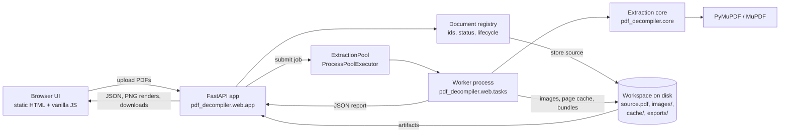
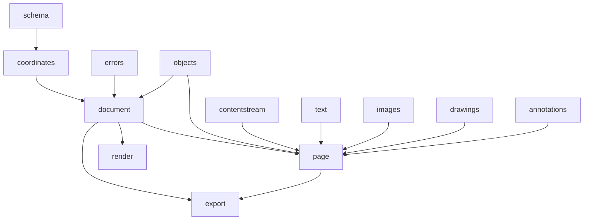
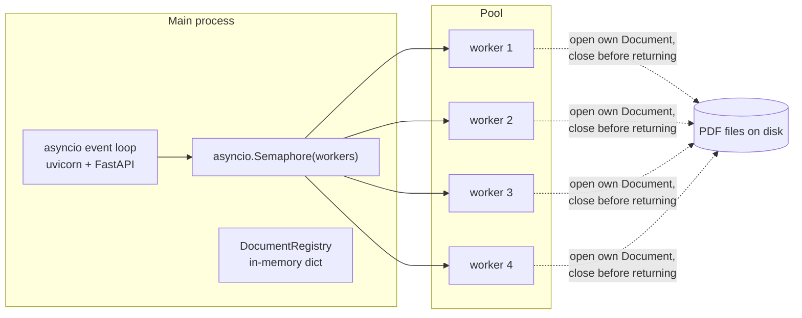
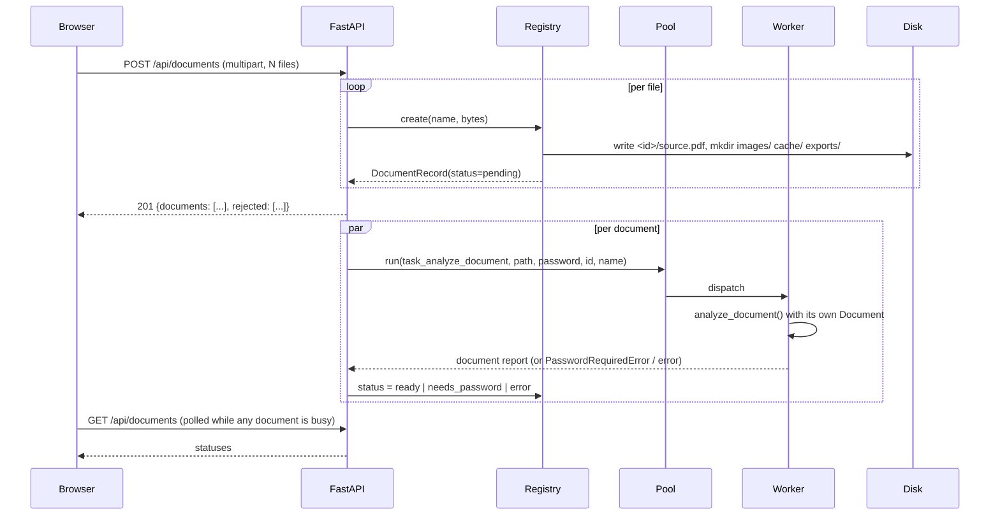
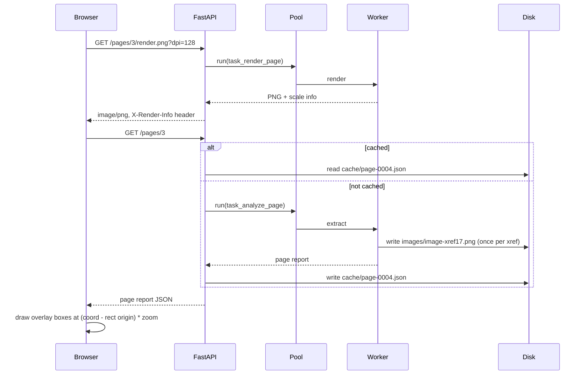
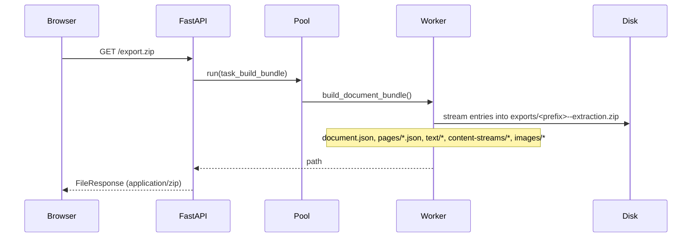
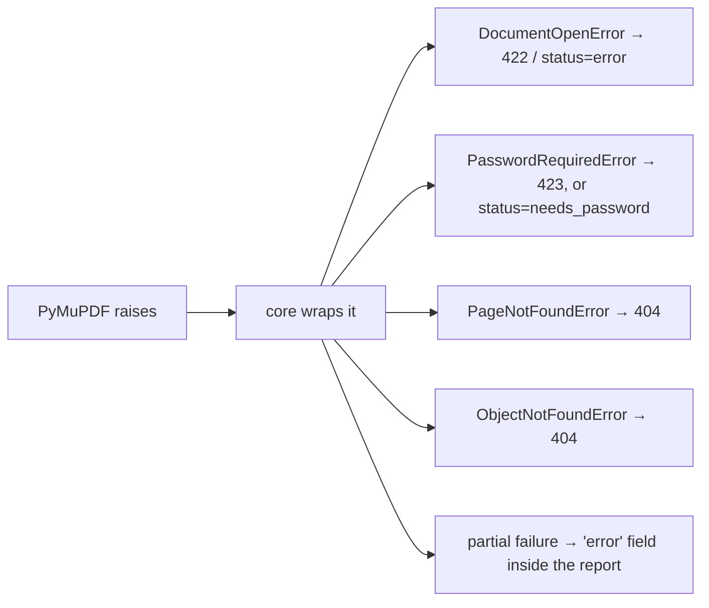

# Architecture

- [Overview](#overview)
- [Layers and the rules between them](#layers-and-the-rules-between-them)
- [Module map](#module-map)
- [Process and concurrency model](#process-and-concurrency-model)
- [Request flows](#request-flows)
- [State and storage](#state-and-storage)
- [Caching](#caching)
- [Error handling](#error-handling)
- [Rendering and overlay alignment](#rendering-and-overlay-alignment)
- [Design decisions](#design-decisions)
- [Extension points](#extension-points)
- [What is deliberately absent](#what-is-deliberately-absent)

## Overview



Three moving parts:

1. **The core** turns a file path into JSON-serialisable data. It knows nothing
   about HTTP.
2. **The web layer** owns identity, lifecycle, scheduling and transport. It
   knows nothing about PDFs.
3. **The UI** is a static page that renders what the API returns and offers
   view / copy / download on every element.

## Layers and the rules between them

| Layer | Package | May import | Must never import |
| --- | --- | --- | --- |
| Core | `pdf_decompiler.core` | `pymupdf`, stdlib | anything web, anything from `pdf_decompiler.web` |
| Web | `pdf_decompiler.web` | `fastapi`, `uvicorn`, `pdf_decompiler.core` | `pymupdf` (directly, in `app.py`) |
| UI | `pdf_decompiler/web/static` | nothing — no build step, no CDN | any external asset |

Two consequences that keep the codebase honest:

- The core is testable and scriptable on its own (`pytest` never starts a
  server; see [core-api.md](core-api.md)).
- Swapping the web framework, or adding a CLI, touches no extraction code.

`pdf_decompiler/web/tasks.py` is the single exception zone: it imports the core
and runs inside worker processes. It contains no logic beyond argument
plumbing, so the boundary stays one file thick.

## Module map

```
pdf_decompiler/
├── __init__.py            version
├── __main__.py            `python -m pdf_decompiler` → uvicorn
├── core/                  EXTRACTION CORE — pure Python, no web dependency
│   ├── __init__.py        public surface re-exported for scripting
│   ├── errors.py          PdfDecompilerError hierarchy; no PyMuPDF exception escapes
│   ├── schema.py          SCHEMA_VERSION, size limits, jsonable(), dumps()
│   ├── coordinates.py     coordinate conventions, rect/matrix helpers, PDF-space conversion
│   ├── document.py        open/authenticate, document report, permissions, fonts, forms,
│   │                      attachments, outline, KNOWN_LIMITATIONS
│   ├── objects.py         xref access, dictionary parsing, page tree, name trees,
│   │                      structure tree, page resources
│   ├── contentstream.py   PDF content-stream lexer → operator listing
│   ├── text.py            page/block/line/span/char extraction, flags, colours
│   ├── images.py          image bytes and properties, placements, deduplication, inline images
│   ├── drawings.py        vector paths with coordinates and paint state
│   ├── annotations.py     annotations, links, widgets
│   ├── page.py            assembles the page report
│   ├── render.py          page → PNG plus scale information
│   └── export.py          zip bundles, whole-document text, combined JSON
└── web/                   WEB LAYER
    ├── app.py             FastAPI routes, error mapping, downloads
    ├── registry.py        DocumentRecord, DocumentRegistry, artifact directories
    ├── jobs.py            ExtractionPool over ProcessPoolExecutor
    ├── tasks.py           picklable functions executed in workers
    └── static/            index.html, app.js, style.css
```

Dependency direction inside the core (nothing cycles):



## Process and concurrency model

PyMuPDF's documentation states plainly that it *"does not support running on
multiple threads — doing so may cause incorrect behaviour or even crash Python
itself"*, and recommends `multiprocessing`. Extraction is also CPU-bound, so
running it inside the event loop would freeze every other request.

Therefore:



- One `ProcessPoolExecutor`, sized `PDF_DECOMPILER_WORKERS` or
  `min(4, cpu_count())`.
- `ExtractionPool.run()` acquires a semaphore of the same size, so queued work
  waits instead of piling up.
- Every task function opens its own `pymupdf.Document` and closes it in a
  `finally`. No `Document`, `Page` or `Pixmap` object ever crosses a process
  boundary; only paths, ints, strings, dicts and bytes do.
- The pool starts in the FastAPI `lifespan` handler and shuts down there.

Uploads are analysed by `asyncio.create_task(_analyze(record))` per document,
so an upload of ten files returns immediately and the ten analyses proceed
through the pool at the configured concurrency.

## Request flows

### Upload and analysis



### Viewing a page



### Complete export



## State and storage

```
<workspace>/                      default ./.workspace, override with PDF_DECOMPILER_WORKSPACE
└── <document_id>/                32-char hex UUID, one per open document
    ├── source.pdf                the uploaded bytes, verbatim
    ├── images/                   image-xref<N>.<ext>, image-inline-p<page>-<n>.<ext>
    ├── cache/                    page-0001.json … extracted page reports
    └── exports/                  <prefix>--extraction.zip
```

- The registry is an in-memory `dict[str, DocumentRecord]`; the on-disk
  directory is the artifact store.
- The workspace is **emptied on startup** (`registry.reset_workspace()`), so a
  restart is a clean slate and no stale file survives.
- Closing a document deletes its directory; shutdown closes everything.

`DocumentRecord` carries: id, source name, directory, size, creation time,
status, stage, error, page count, SHA-256, password (in memory only), the
document report, and the id of an identical open document if there is one.

## Caching

| Thing | Cached where | Invalidated |
| --- | --- | --- |
| Document report | `DocumentRecord.report` in memory | On unlock (re-analysis) or close |
| Page report | `<id>/cache/page-NNNN.json` | On close; a corrupt cache file is deleted and regenerated |
| Extracted images | `<id>/images/` keyed by xref | On close; written once per xref |
| Export bundle | `<id>/exports/…zip` | Rebuilt on each request |
| Page renders | Not cached (`Cache-Control: no-store`) | — |
| Image previews (PNG re-encode) | Not cached (`Cache-Control: no-store`) | — |

The browser keeps its own per-document state — scroll position, current page,
zoom, overlay toggles, active tab, loaded object, recent page reports — in a
`Map` keyed by document id, so switching documents returns to the same place.
Page reports and rendered bitmaps are the only unbounded costs, so both are
capped: the page scroller keeps a small window of rendered pages around the
current one and releases the rest.

## Error handling



Principles:

1. **One bad document never affects another.** Analysis failures are captured
   on the record, not raised to other requests.
2. **Partial extraction still returns.** If a stream will not decode or an
   annotation cannot be read, that section carries an `error` string and the
   rest of the report is intact.
3. **Never a silent empty result.** A page with no text says so
   (`text.note`); an untagged document says so (`warnings`); features PyMuPDF
   cannot reach are listed in `known_limitations`.
4. **No internal paths leak.** Error strings from the core have the workspace
   path replaced with the user's own file name before they reach the UI.

## Rendering and overlay alignment

The renderer and the layout are deliberately decoupled:

- The browser asks for `render.png?dpi=round(96 × zoom)`, capped to 400 dpi by
  the core. That controls raster sharpness only.
- The overlay stage is sized `page.rect × zoom` in CSS pixels, and each box is
  placed at `(coordinate − page_rect_origin) × zoom`.

Because boxes and the rendered bitmap both derive from `page.rect`, they line
up at any zoom, on any page size, and on rotated pages — MuPDF applies
`/Rotate` to both the render and the reported coordinates. `X-Render-Info` on
the PNG response carries `dpi`, `zoom`, pixel size, point size and rotation, so
any other client can do the same arithmetic.

The page view stacks every page of the document in one scroller, and each page
owns its own stage, render and overlay. Alignment is therefore a per-page
property with no shared state: a page's boxes are placed against that page's own
`page.rect`, whatever is scrolled into view. Until a page is loaded, its stage is
sized from the page summary in the document report (`pages[].width/height`),
which is the same `page.rect` size the renderer will report — so the placeholder
occupies exactly the space the real page will take and scrolling does not jump.

## Design decisions

| Decision | Why | Trade-off accepted |
| --- | --- | --- |
| FastAPI + uvicorn | Async endpoints compose directly with a process pool (`await pool.run(...)`); static files, file responses and `/docs` come for free | An ASGI stack is heavier than Flask for a local tool |
| Processes, not threads | PyMuPDF explicitly does not support multi-threaded use; extraction is CPU-bound | Process start-up cost; arguments and results must be picklable |
| Vanilla JS, no build step | `pip install` then run; no npm, no bundler, no lockfile drift | No component framework; the UI is one 1.2k-line file |
| In-memory registry, on-disk artifacts | Simplest thing that supports isolation and cleanup; restart semantics are trivial to state | Nothing survives a restart |
| Lazy page extraction with a disk cache | A 300-page document opens in under a second; pages cost only when opened | The first visit to each page costs a worker round trip |
| Copy the upload into the workspace | The source cannot move or change under a long-running analysis; artifacts stay namespaced | Disk usage doubles for the duration |
| UUID per upload, never a content hash | Same file twice, or same name twice, cannot collide; duplicates are *reported*, not merged | Two entries for identical bytes |
| Own content-stream parser | PyMuPDF exposes decoded stream bytes but no operator listing; the operator view is the "decompiled" heart of the tool | A parser to maintain; deliberately kept small and tested |
| Binary payloads on disk, never inline | Every report stays JSON-serialisable and small enough to send | Images are one HTTP request away |
| Everything in PyMuPDF space | One convention, stated once, applied everywhere | Users who think in PDF space must apply the published matrix |

## Extension points

Adding a PDF feature usually means touching four places, in this order:

1. `core/<concern>.py` — a function that takes a `Document`/`Page` and returns
   JSON-safe data, failing soft with an `error` key.
2. `core/page.py` or `core/document.py` — a new top-level key in the report.
3. `docs/schema.md` — document the key.
4. `web/static/app.js` — a panel, an overlay kind or a details row, with
   view / copy / download.

If it needs a new endpoint, add a picklable function to `web/tasks.py` and a
route to `web/app.py`. Step-by-step instructions live in
[CONTRIBUTING.md](../CONTRIBUTING.md#adding-an-extractor).

## What is deliberately absent

No database, no authentication, no user accounts, no background job queue, no
websockets, no server-side templating, no front-end framework, no telemetry, no
network calls, no OCR, no PDF writing or editing. Each of those would earn its
place only with a requirement behind it; none exists today.
