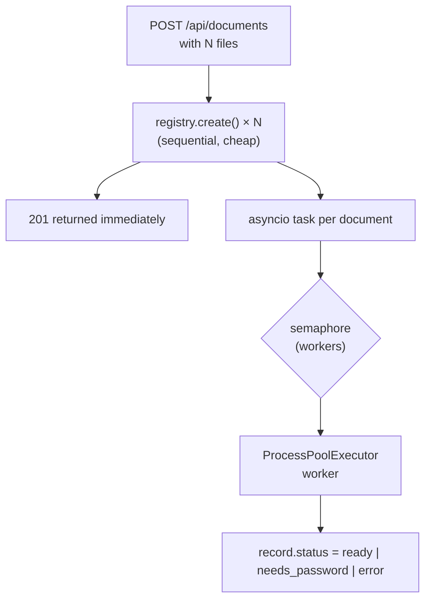
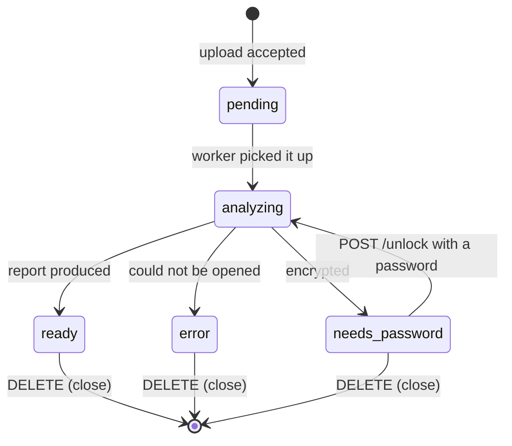

# Multi-document behaviour

How the tool keeps several PDFs open at once without letting them interfere.

- [Identity](#identity)
- [Artifact layout](#artifact-layout)
- [Isolation guarantees](#isolation-guarantees)
- [Concurrency](#concurrency)
- [Status lifecycle](#status-lifecycle)
- [Failure containment](#failure-containment)
- [Duplicates and name collisions](#duplicates-and-name-collisions)
- [Encrypted documents](#encrypted-documents)
- [Limits](#limits)
- [Cleanup and restart behaviour](#cleanup-and-restart-behaviour)
- [UI state per document](#ui-state-per-document)
- [Download naming](#download-naming)
- [How this is tested](#how-this-is-tested)

## Identity

Each upload receives a fresh `uuid4().hex` — a 32-character hex string — as its
**document id**. Nothing about the file influences it: not the name, not the
content, not the order.

| Property | Value |
| --- | --- |
| Source of the id | `uuid.uuid4()` at upload time |
| Stable for | The lifetime of the server process |
| Reused | Never |
| Related to the PDF's `/ID` | No; the file's own `/ID` is reported separately in `file.document_id` |

Consequences: uploading the same file twice creates two independent documents,
and two different files called `report.pdf` never share anything.

## Artifact layout

```
<workspace>/                                 ./.workspace, or PDF_DECOMPILER_WORKSPACE
├── 905d4d6dbfcc47c8b6495bd00da07213/        document id
│   ├── source.pdf                           the uploaded bytes, verbatim
│   ├── images/
│   │   ├── image-xref11.png                 one file per image XObject
│   │   └── image-inline-p0-0.png            one file per inline image occurrence
│   ├── cache/
│   │   ├── page-0001.json                   extracted page reports
│   │   └── page-0002.json
│   └── exports/
│       └── invoice--905d4d6d--extraction.zip
└── ad746705f4e04ad0a02aa5c7f2a51db4/
    └── …
```

Everything belonging to a document lives under its own directory. No file is
shared, and no name is global.

## Isolation guarantees

| Guarantee | How it holds |
| --- | --- |
| No shared mutable state | The registry holds one `DocumentRecord` per document; nothing is global except configuration |
| No shared PyMuPDF objects | Every extraction opens its own `Document` in a worker process and closes it before returning |
| No artifact collisions | Image names are unique only inside a document directory, which is keyed by an unguessable UUID |
| No cache bleed | Page reports are cached at `<id>/cache/page-NNNN.json` |
| No download ambiguity | Every download name carries the source stem and the id prefix |
| No failure propagation | Analysis runs in its own task; an exception is recorded on that record only |

The upload is **copied** into the workspace rather than referenced in place, so
a long-running analysis cannot be disturbed by the original file moving or
changing.

## Concurrency



- The pool has `PDF_DECOMPILER_WORKERS` processes, defaulting to
  `min(4, cpu_count())`.
- `ExtractionPool.run()` waits on a semaphore of the same size, so surplus work
  queues instead of oversubscribing the machine.
- Uploading ten files returns at once; the analyses proceed at the configured
  parallelism while the UI polls for status.
- The event loop is never blocked: every PDF operation — analysis, page
  extraction, rendering, object reads, exports — goes through the pool.
- Page extractions, renders and exports for *different* documents interleave
  freely; there is no per-document lock, because nothing is shared to protect.

Why processes and not threads: PyMuPDF's documentation states it *"does not
support running on multiple threads — doing so may cause incorrect behaviour or
even crash Python itself"* and recommends `multiprocessing`. Extraction is also
CPU-bound, so threads would not help anyway.

## Status lifecycle



`stage` carries a human-readable substate: `queued`, `reading document
structure`, `waiting for password`, `building export bundle`, `ready`,
`failed`. The sidebar shows it directly, which is how progress stays visible
without freezing the UI.

## Failure containment

| Failure | Effect on that document | Effect on the others |
| --- | --- | --- |
| Not a PDF, or fatally damaged | `status: error` with the reason | None |
| Wrong or missing password | `status: needs_password` | None |
| One page fails to extract | That page returns 422; other pages work | None |
| One stream will not decode | `decode_error` in that section | None |
| Export bundle fails | 422, or `EXPORT-FAILED.txt` inside `all.zip` | None |
| Worker process dies | That request fails; the pool replaces the process | None |

Error strings shown to the user have the internal workspace path replaced with
the user's own file name, so nothing about the server's filesystem leaks into
the UI.

## Duplicates and name collisions

| Case | Behaviour |
| --- | --- |
| Same file uploaded twice | Two documents, two ids, two directories. The second is annotated `duplicate_of: <first id>` and the sidebar says *"same bytes as another open document"*. Nothing is merged or deduplicated |
| Two different files with the same name | Completely independent; download names differ by the id prefix |
| Same file open while the first is still analysing | Fine — duplicate detection runs when analysis finishes and simply may not find the other one yet |

Duplicate detection compares the SHA-256 of the file bytes, computed once
during analysis.

## Encrypted documents

- A document that needs a password stops at `needs_password`; nothing else is
  extracted.
- `POST /unlock` stores the password **in memory on the record** and re-runs
  analysis. It is needed later because every page extraction reopens the file.
- The password is never written to disk, never included in a report or export,
  and disappears when the document is closed or the server stops.
- A wrong password returns 401 and leaves the document locked.

## Limits

| Limit | Default | Change with | Behaviour at the limit |
| --- | --- | --- | --- |
| Open documents | 25 | `MAX_OPEN_DOCUMENTS` in `web/registry.py` | Further uploads appear in `rejected` with a clear message |
| Upload size per file | 512 MB | `PDF_DECOMPILER_MAX_UPLOAD_MB` | That file is rejected; the others in the same request still upload |
| Concurrent extractions | `min(4, CPU)` | `PDF_DECOMPILER_WORKERS` | Work queues on a semaphore |
| Disk | Unbounded | — | Artifacts grow with pages visited and exports built; close documents to reclaim |

See [configuration.md](configuration.md) for the environment variables.

## Cleanup and restart behaviour

| Event | What happens |
| --- | --- |
| **Close** (`DELETE /api/documents/{id}`) | The record is dropped and the whole `<workspace>/<id>/` directory is deleted: source copy, images, page cache, exports |
| **Server shutdown** | Every document is closed the same way, then the pool shuts down |
| **Server start** | The workspace directory is deleted and recreated — a **clean slate** |
| **Crash** | Artifacts from the previous run survive on disk but are orphaned; the next start deletes them |

The state model is deliberately the simple one: **the registry is in memory,
artifacts are on disk, and a restart loses the open-document list**. Nothing is
restored, and no stale file survives. If you need persistence, re-upload.

## UI state per document

Each open document keeps, in the browser tab only:

- scroll position in the page scroller and the current page index,
- zoom,
- overlay toggles,
- active tab,
- the object currently loaded in the object browser,
- the most recently fetched page reports (older ones are dropped so a long
  document cannot grow the tab without bound).

Switching documents preserves all of it, and each document scrolls
independently: coming back lands on the page you left, not on page 1. Reloading
the browser page resets the UI state but not the documents, which live on the
server.

## Download naming

`file_prefix` is `<sanitised source stem>--<first 8 chars of the document id>`,
for example `invoice_2024--905d4d6d`. Sanitising keeps letters, digits, dot,
underscore and hyphen, and truncates to 60 characters. Every download starts
with it, so a downloads folder holding output from five open documents stays
readable. The all-documents archive nests each bundle under its own prefix.

## How this is tested

`tests/test_concurrency.py` runs two different documents through a real
`ProcessPoolExecutor` at the same time and asserts:

- each report carries its own `document_id` and its own metadata;
- text unique to one document never appears in the other's report;
- images land in the per-document directories they were given, with no
  cross-writing;
- the export bundle for a document contains every expected part.

`tests/test_document.py` covers the failure paths — corrupt file, encrypted
file with and without the password — that the isolation guarantees depend on.
